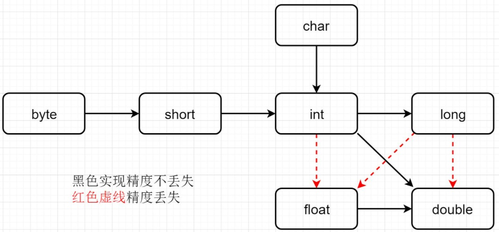

<!-- START doctoc generated TOC please keep comment here to allow auto update -->
<!-- DON'T EDIT THIS SECTION, INSTEAD RE-RUN doctoc TO UPDATE -->
**Table of Contents**  *generated with [DocToc](https://github.com/thlorenz/doctoc)*

- [Scala语言入门](#scala%E8%AF%AD%E8%A8%80%E5%85%A5%E9%97%A8)
  - [环境配置](#%E7%8E%AF%E5%A2%83%E9%85%8D%E7%BD%AE)
  - [IDEA环境配置](#idea%E7%8E%AF%E5%A2%83%E9%85%8D%E7%BD%AE)
  - [变量与数据类型](#%E5%8F%98%E9%87%8F%E4%B8%8E%E6%95%B0%E6%8D%AE%E7%B1%BB%E5%9E%8B)
  - [运算符](#%E8%BF%90%E7%AE%97%E7%AC%A6)
  - [控制流](#%E6%8E%A7%E5%88%B6%E6%B5%81)
  - [函数式编程](#%E5%87%BD%E6%95%B0%E5%BC%8F%E7%BC%96%E7%A8%8B)
  - [面向对象](#%E9%9D%A2%E5%90%91%E5%AF%B9%E8%B1%A1)
  - [集合](#%E9%9B%86%E5%90%88)
  - [模式匹配](#%E6%A8%A1%E5%BC%8F%E5%8C%B9%E9%85%8D)
  - [泛型](#%E6%B3%9B%E5%9E%8B)

<!-- END doctoc generated TOC please keep comment here to allow auto update -->

# Scala语言入门

Scala（发音为/ˈskɑːlə, ˈskeɪlə/）是一门多范式的编程语言，设计初衷是要集成面向对象编程和函数式编程的各种特性。洛桑联邦理工学院的Martin Odersky于2001年基于Funnel的工作开始设计Scala。Java平台的Scala于2003年底/2004年初发布。

特点：
- 同样运行在JVM上，可以与现存程序同时运行。
- 可直接使用Java类库。
- 同Java一样静态类型。
- 语法和Java类似，比Java更加简洁(注意简洁不代表简单，会更复杂一点)，表达性更强。
- 同时支持面向对象、函数式编程。
- 比Java更面向对象。

关注点：
- 类型推断、不变量、函数式编程、高级程序构造。
- 并发：actor模型。
- 和现有Java代码交互、相比Java异同和优缺。

和Java关系：
```
        javac               java
.java --------> .class ----------> run on JVM
.scala -------> .class ----------> run on JVM
        scalac              scala
```

阅读：
- [尚硅谷大数据技术之Scala入门到精通教程](https://www.bilibili.com/video/BV1Xh411S7bP)

## 环境配置

Scala需要依赖Java，访问[这里](https://docs.scala-lang.org/overviews/jdk-compatibility/overview.html)查看特定Scala版本依赖的Java版本。这里选择，最新的JDK17配合Scala2.13.6。

Windows中下载安装配置环境变量：
- 类似于java配置`SCALA_HOME`为安装目录。
- 添加`%SCALA_HOME%\bin`到path环境变量。

Linux中类似，可以使用包管理器，但如果依赖版本不严格一致的话，需要官网下载对应版本安装即可。

也有交互式执行环境：
```
scala
```

交互式执行环境中的传统艺能：
```scala
println("hello,world!");
```

暂时不管项目配置，还是单文件编译执行为主，项目开发肯定要以包的形式组织可以使用IntelliJ IDEA或者sbt，不详述。

使用VSCode编辑器，安装插件Scala Syntax (official)。

新建文件`HelloScala.scala`。
```scala
object HelloScala { // HelloScala is a object, not a class, will create a 
    def main(args : Array[String]) : Unit = {
        println("hello,world!");
    }
}
```

可以使用插件CodeRunner直接快捷键运行。也可以在命令行编译为字节码后再运行：
```
scalac HelloScala.scala
scala helloScala
```
或者直接运行scala源文件：
```
scala HelloScala.scala
```
和java如出一辙。

如果编译的话会生成2个`.class`字节码文件，`HelloScala.class`和`HelloScala$.class`。都是字节码但是不能通过`java`直接运行。但对于HelloWorld这个例子来说，java源代码编译而成的字节码是可以通过`scala`命令运行的。

原因是没有引入Scala的库，添加`classpath`就可以通过java执行scala编译成的字节码了：
```
java -cp %SCALA_HOME%/lib/scala-library.jar; HelloScala
```
使用[Java Decompiler](http://java-decompiler.github.io/)反编译字节码到java源文件可以看到引入Scala库的逻辑。并且：
- scala源文件中的`HelloScala`对象编译后成为了一个类，但对象本身编译后就是生成的另一个类`HelloScala$`类的单例对象`HelloScala$.MODULE$`，称之为伴生对象。
- `HelloScala$`有一个`main`实例方法，`HelloScala`类的静态方法通过这个单例对象转调这个实例方法。完成打印。
- Scala比Java更面向对象。

## IDEA环境配置

使用IntelliJ IDEA：
- 创建Maven项目，JDK版本17。
- 安装插件：Scala。多半已经安装。
- Maven项目默认用Java写，在`main/`目录下新建目录`scala/`，然后将目录标记为Source Root。
- 这样甚至可以在同一个项目中混用Scala和Java源文件，并互相调用。
- 需要能够添加scala源文件，右键项目，添加框架支持，配置Scala SDK，选择，然后就可以右键添加Scala源文件了。
- 添加包，添加Scala类，选择对象，编辑源码。
```scala
package VeryStarted

object HelloWorld {
  def main(args: Array[String]): Unit= {
    println("Hello,world!")
  }
}
```
- Ctrl + Shift + F10运行。
- 可以看到执行的命令是`java`在`classpath`中引入了Scala的`jar`包形式的库。
- 调用java的类库：
```scala
package VeryStarted

object HelloWorld {
  def main(args: Array[String]): Unit= {
    println("Hello,world!")
    System.out.println("Hello,world! from java")
  }
}
```

语法含义：
```scala
object SingletonObject { body }
def MethodName(ArgName: ArgType): RetType = { body }
```

`object`关键字创建的伴生对象，可以理解为替代Java的`static`关键字的方式，将静态方法用单例对象的实例方法做了替代，做到了更纯粹的面向对象。

仅仅测试理解语法既可以单文件编写VSCode编译执行也可以用IDEA管理项目，影响不大。

再用一个等价的类定义来认识和区别一下Scala和Java：

java:
```java
public class Student {
    private String name;
    private Integer age;
    private static String school = "XDU";

    public Student(String name, Integer age) {
        this.name = name;
        this.age = age;
    }

    public void printInfo() {
        System.out.println(this.name + " " + this.age + " " + Student.school);
    }

    // psvm
    public static void main(String[] args) {
        Student tch = new Student("tch", 20);
        tch.printInfo();
    }
}
```
scala:
```scala
package VeryStarted

class Student(name: String, age: Int) {
  def printInfo(): Unit = {
    println(name + " " + age + " " + Student.school)
  }
}

// 引入伴生对象，名称一致，同一个文件
object Student {
  val school: String = "XDU"

  def main(args: Array[String]): Unit = {
    val tch = new Student("tch", 20)
    tch.printInfo()
  }
}
```

Scala库源码与API文档：
- 官网上下载下载Scala源码，解压到Scala安装目录或任意位置。
- IntelliJ IDEA进入反编译的源码后选择右上角附加源码，选择源码的`src/`目录。
- 下载文档到本地，

## 变量与数据类型

注释：
- 和java一样
- `//` 单行
- `/* */` 多行
- `/** */` 文档，方法或者类前面，便于`scaladocs`生成文档。

变量和常量：
```scala
var name [:VariableType] = value // variable
val name [:ConstantType] = value // constant
```
因为Scala的函数式编程要素，所以一个指导意见就是能用常量就不要用变量。
- 声明变量时，类型可以省略，编译器会自动推导。
- 静态类型，类型经过给定或推导确定后就不能修改。
- 变量和常量声明时，必须有初始值。
- 变量可变，常量不可变。
- 引用类型常量，不能改变变量指向的对象，可以改变对象的字段。
- 不以`;`作为语句结尾

标识符命名规范：
- 字母下划线开头，跟字母数字下划线，和C/C++/Java一样。
- 操作符开头，且只包含(+-*/#!等)。也是有效的标识符？这，好处在哪儿呢？
- 用反引号包括的任意字符串，即使是同39个Scala关键字同名也可以。有点奇怪的用法。

```scala
var _abc:String = "hello"
val -+/%# = 10
val `if` = 10
println(_abc)
println(-+/%#)
println(`if`)
```


关键字：
- `package import class obejct trait extends with type for`
- `private protected abstract sealed final implicit lazy override`
- `try catch finlly throw`
- `if else match case do while for return yield`
- `def var val`
- `this super`
- `new`
- `true false null`
- 其中Java没有的关键字：`object trait with implicit match yield def val var`

字符串：
- 类型：`String`
- `+`号连接
- `*`字符串乘法，复制一个字符串多次
- `printf`格式化输出
- 字符串模板：`s"xxx${varname}"`前缀`s`模板字符串，前缀`f`格式化模板字符串，通过`$`获取变量值
- 原始字符串：`raw"rawstringcontents${var}"`，不考虑模板字符串。
- 多行字符串：`""" """`。
- 输出：`print printf println ...`
```scala
val name: String = "Pyrrha" + " " + "Nikos"
val age = 17
println((name + " ") * 3)
printf("%s : dead in %d\n", name, age)
print(s"$name : dead in ${age}")
val power = 98.9072
println(f" : power ${power}%.2f.")

var sql = s"""
    |Select *
    |from 
    |   Student
    |Where
    |   name = ${name}
    |and
    |   age >= ${age}
""".stripMargin // strip | and whitespaces before |
println(sql)
```

输入：
- `StdIn.readLine()`
- `StdIn.readShort() StdIn.readDouble`
- `import scala.io.StdIn`
```scala
println("input name:")
val name: String = StdIn.readLine()
println("input age:")
val age:Int = StdIn.readInt()
println(name + " : " + age)
```

读写文件：
```scala
import scala.io.Source
import java.io.PrintWriter
import java.io.File
object FileIO {
    def main(args: Array[String]): Unit ={
        // read from file
        Source.fromFile("FileIO.txt").foreach(print)

        // write to file
        // call java API to write
        val writer = new PrintWriter(new File("WFile.txt"))
        writer.write("Nephren!")
        writer.close()
    }
}
```

数据类型：
- java基本类型`char byte short int logn float double boolean`。
- java基本类型对应包装类型：`Charater Byte Short Integer Long Float Double Boolean`。
- java中不是纯粹的面向对象。
- Scala吸取了这一点，所有数据都是对象，都是`Any`的子类。
- `Any`有两个子类：`AnyVal`值类型 `AnyRef`引用类型。
- 数值类型都是`AnyVal`子类，和Java数值包装类型都一样，只有整数在scala中是`Int`有点区别。
- `StringOps`是java中`String`类增强，`AnyVal`子类。
- `Unit`对应java中的`void`，`AnyVal`子类。用于方法返回值的位置，表示方法无返回值，`Unit`是一个类型，只有一个对象`()`（这tm是一个对象？）。
- `Void`不是数据类型，只是一个关键字。
- `Null`是一个类型，只有一个对象`null`，所有引用类型`AnyRef`的子类，主要用途是与其他JVM语言互操作，几乎不在Scala代码中使用。
- `Nothing`所有类型的子类型，也称为底部类型。它常见的用途是发出终止信号，例如抛出异常、程序退出或无限循环。


整数类型：都是有符号整数，标准补码表示。
- `Byte` 1字节
- `Short` 2字节
- `Int` 4字节
- `Long` 8字节
- 整数赋初值超出表示范围报错。
- 自动类型推断，整数字面值默认类型`Int`，长整型字面值必须加`L`后缀表示。
- 向下转换会失败，需要类型转换，`(a + 10).toByte`。

浮点类型：
- `Float` IEEE 754 32位浮点数
- `Double` IEEE 754 64位浮点数
- 默认`Double`

字符类型：
- 字符常量：`''`
- 类型`Char`
- 转义：`\t \n \r \\ \" \'`etc

布尔类型：`true false`

空类型：
- `Unit` 无值，用于函数返回值。
- `Null` 只有一个实例`null`，空引用。
- `Nothing` 确定没有正常的返回值，可以用Nothing来指定返回值类型。好像意思是抛异常时返回Nothing。不太懂。
```scala
object NullType {
    def main(arg : Array[String]) : Unit = {
        // Unit
        def f1(): Unit = {
            println("just nothing!")
        }
        val a = f1()
        println(a) // ()

        // Null
        // val n:Int = null // invalid
    }
}
```

数据类型转换：
- 自动提升：多种数据类型混合运算，自动提升到精度最大的数据类型。
- 高精度赋值到低精度，直接报错。
- 除了图中的隐式类型转换，都需要强制类型转换。
- `Byte Short Int`计算时会直接提升为`Int`


强制类型转换：
- `toByte toInt toChar to`
- `'a'.toInt` `2.7.toInt`
- 数值与String的转换：`"" + n` `"100".toInt` `"12.3".toFloat` `12.3".toDouble.toInt`
- 强转是二进制截取，整数高精度转低精度可能会溢出，比如`128.toByte`。

## 运算符


## 控制流


## 函数式编程


## 面向对象

## 集合

## 模式匹配

## 泛型
